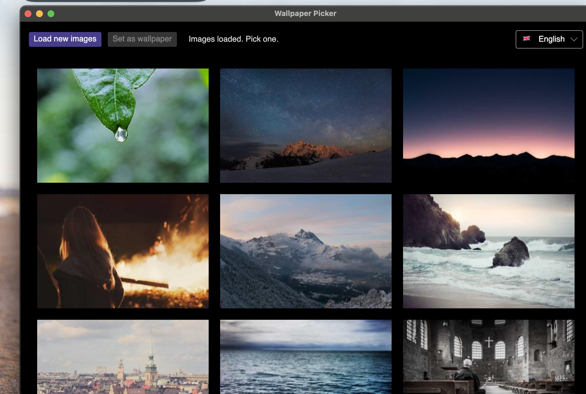

<div align="right">
  <a href="#-deutsch">🇩🇪 Deutsch</a> &nbsp;|&nbsp;
  <a href="#-français">🇫🇷 Français</a> &nbsp;|&nbsp;
  <a href="#-español">🇪🇸 Español</a> &nbsp;|&nbsp;
  <a href="#-italiano">🇮🇹 Italiano</a>
</div>

# WallpaperPicker

A lightweight, cross-platform desktop app to browse random photos and set them as your desktop wallpaper — with a single click.

<p align="center">
  
</p>

<p align="center">
  
  
  
  
  
</p>

---

## Features

- **Random wallpapers** — fetches 9 unique photos from [Picsum Photos](https://picsum.photos) on every refresh
- **One-click selection** — click any image to select it; the blue outline shows your current pick
- **High-resolution download** — downloads the full 2880×1800 image before setting it as wallpaper
- **Cross-platform** — works on macOS, Windows, and a wide range of Linux desktop environments
- **Covers all your displays** — sets the wallpaper on every monitor at once
- **Multi-language UI** — auto-detects your system language; English fallback if unsupported

### Linux Desktop Environment Support

| Desktop | Method |
|---|---|
| GNOME, Unity, Budgie, Ubuntu | `gsettings` |
| KDE Plasma | `plasma-apply-wallpaperimage` / `qdbus` |
| XFCE | `xfconf-query` |
| MATE | `gsettings` |
| Cinnamon | `gsettings` |
| LXQt | `pcmanfm-qt` |
| LXDE | `pcmanfm` |
| Deepin / DDE | `gsettings` |
| Enlightenment | `enlightenment_remote` |
| Sway | `swaymsg` |
| Hyprland | `swww` / `hyprctl hyprpaper` |
| i3, Openbox, Fluxbox, IceWM, JWM | `feh` / `nitrogen` |

---

## Requirements

- [.NET 10 SDK](https://dotnet.microsoft.com/download/dotnet/10.0)

---

## Build & Run

### Run directly

```bash
dotnet run
```

### Build a standalone macOS app bundle

```bash
chmod +x build.sh
./build.sh
```

This produces a `WallpaperPicker.app` you can move to your `/Applications` folder.

---

## Usage

1. Click **Load new images** — 9 random photos appear in the grid.
2. Click any photo to select it (highlighted in blue).
3. Click **Set as wallpaper** — the full-resolution image is applied to all your displays.
4. Repeat whenever you want a fresh look.

---

## Languages

The UI is available in five languages, selectable via the dropdown in the top-right corner of the app:

| Flag | Language |
|---|---|
| 🇬🇧 | English *(default / fallback)* |
| 🇩🇪 | Deutsch |
| 🇫🇷 | Français |
| 🇪🇸 | Español |
| 🇮🇹 | Italiano |

The app automatically selects your system language on startup. If your system language is not supported, it falls back to English.

---

## Tech Stack

| Component | Technology |
|---|---|
| UI Framework | [Avalonia UI](https://avaloniaui.net) 12 |
| Runtime | .NET 10 |
| Image Source | [Picsum Photos](https://picsum.photos) |
| macOS wallpaper | AppleScript via `osascript` |
| Windows wallpaper | `SystemParametersInfo` (Win32) |
| Linux wallpaper | Desktop-environment-specific CLI tools |

---

## Project Structure

```
WallpaperPicker/
├── Program.cs              # All application code
├── WallpaperPicker.csproj  # Project file
├── build.sh                # macOS .app bundle builder
└── assets/
    └── screenshot.png
```

---

<div id="-deutsch"></div>

---

## 🇩🇪 Deutsch

Ein schlanker, plattformübergreifender Desktop-App zum Browsen zufälliger Fotos und Setzen als Desktophintergrund — mit einem einzigen Klick.

- **Zufällige Hintergründe** — lädt bei jedem Refresh 9 neue Fotos von [Picsum Photos](https://picsum.photos)
- **Auswahl per Klick** — Bild anklicken, blauer Rahmen zeigt die aktuelle Auswahl
- **High-Res-Download** — lädt das Bild in 2880×1800 herunter, bevor es gesetzt wird
- **Plattformübergreifend** — macOS, Windows und viele Linux-Desktop-Umgebungen
- **Sprachauswahl** — App erkennt die Systemsprache automatisch, Fallback auf Englisch

```bash
dotnet run        # direkt starten
./build.sh        # macOS .app Bundle erzeugen
```

1. **Neue Bilder laden** klicken — 9 zufällige Fotos erscheinen im Raster.
2. Ein Foto anklicken (blauer Rahmen = ausgewählt).
3. **Als Hintergrund setzen** klicken — fertig.

---

<div id="-français"></div>

## 🇫🇷 Français

Une application de bureau légère et multiplateforme pour parcourir des photos aléatoires et les définir comme fond d'écran — en un seul clic.

- **Fonds d'écran aléatoires** — charge 9 nouvelles photos depuis [Picsum Photos](https://picsum.photos) à chaque actualisation
- **Sélection en un clic** — cliquez sur une image pour la sélectionner (contour bleu)
- **Téléchargement haute résolution** — télécharge l'image en 2880×1800 avant de l'appliquer
- **Multiplateforme** — macOS, Windows et de nombreux environnements Linux
- **Interface multilingue** — détecte automatiquement la langue du système, anglais par défaut

```bash
dotnet run        # lancer directement
./build.sh        # créer un bundle .app macOS
```

1. Cliquer sur **Charger de nouvelles images** — 9 photos apparaissent dans la grille.
2. Cliquer sur une photo pour la sélectionner (contour bleu).
3. Cliquer sur **Définir comme fond d'écran** — c'est fait.

---

<div id="-español"></div>

## 🇪🇸 Español

Una aplicación de escritorio ligera y multiplataforma para explorar fotos aleatorias y establecerlas como fondo de pantalla — con un solo clic.

- **Fondos aleatorios** — carga 9 fotos nuevas desde [Picsum Photos](https://picsum.photos) en cada actualización
- **Selección con un clic** — haz clic en una imagen para seleccionarla (borde azul)
- **Descarga en alta resolución** — descarga la imagen en 2880×1800 antes de aplicarla
- **Multiplataforma** — macOS, Windows y muchos entornos de escritorio Linux
- **Interfaz multilingüe** — detecta automáticamente el idioma del sistema, inglés como alternativa

```bash
dotnet run        # ejecutar directamente
./build.sh        # crear un bundle .app de macOS
```

1. Hacer clic en **Cargar nuevas imágenes** — aparecen 9 fotos en la cuadrícula.
2. Hacer clic en una foto para seleccionarla (borde azul).
3. Hacer clic en **Establecer como fondo** — listo.

---

<div id="-italiano"></div>

## 🇮🇹 Italiano

Un'applicazione desktop leggera e multipiattaforma per sfogliare foto casuali e impostarle come sfondo — con un solo clic.

- **Sfondi casuali** — carica 9 nuove foto da [Picsum Photos](https://picsum.photos) ad ogni aggiornamento
- **Selezione con un clic** — clicca su un'immagine per selezionarla (bordo blu)
- **Download in alta risoluzione** — scarica l'immagine in 2880×1800 prima di applicarla
- **Multipiattaforma** — macOS, Windows e molti ambienti desktop Linux
- **Interfaccia multilingue** — rileva automaticamente la lingua del sistema, inglese come lingua di riserva

```bash
dotnet run        # avvio diretto
./build.sh        # creare un bundle .app per macOS
```

1. Cliccare su **Carica nuove immagini** — appaiono 9 foto nella griglia.
2. Cliccare su una foto per selezionarla (bordo blu).
3. Cliccare su **Imposta come sfondo** — fatto.
